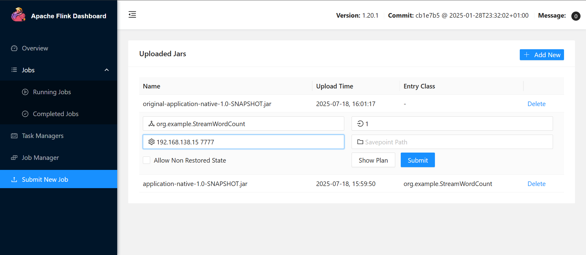
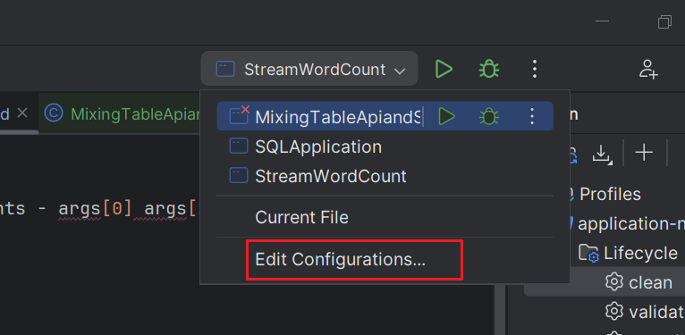
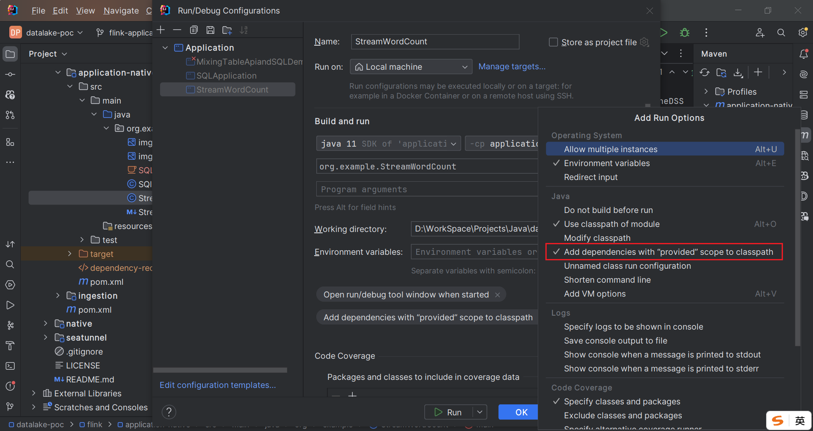

Submit

Main Class, Parallelism, Arguments - args[0] args[1]




Console

```
docker logs -f flink-taskmanager-1 -n 0
```

```
docker logs -f flink-taskmanager-2 -n 0
```

# For Provided Run

add dependencies with 'provided' scope to classpath


