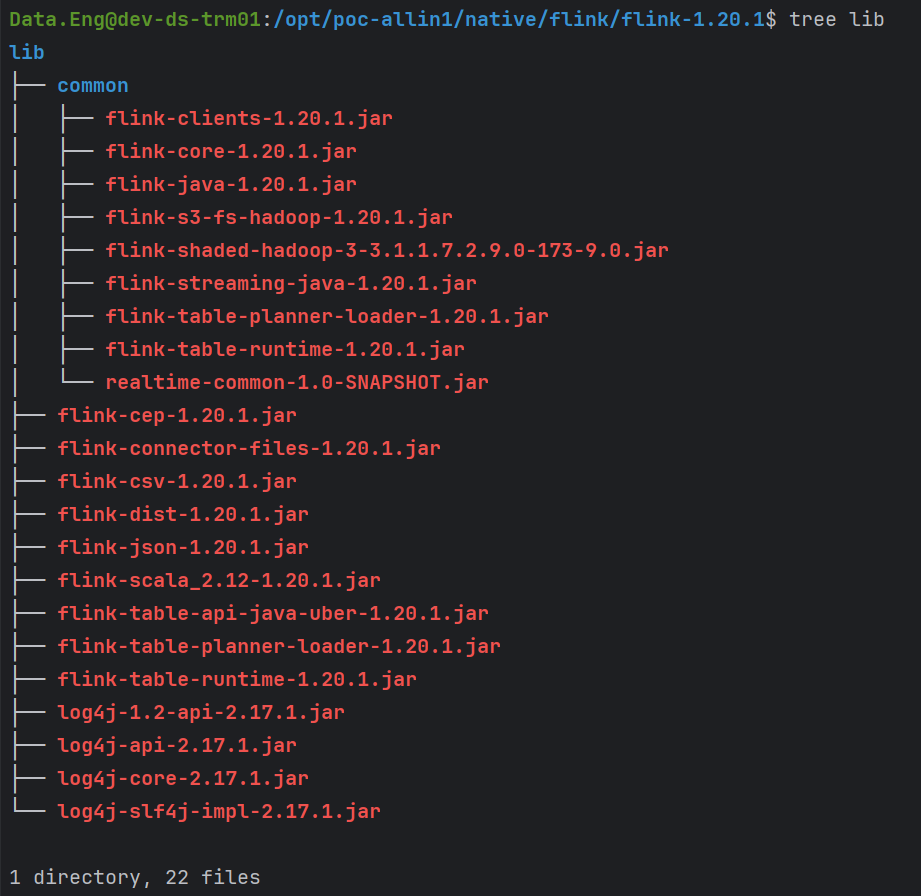
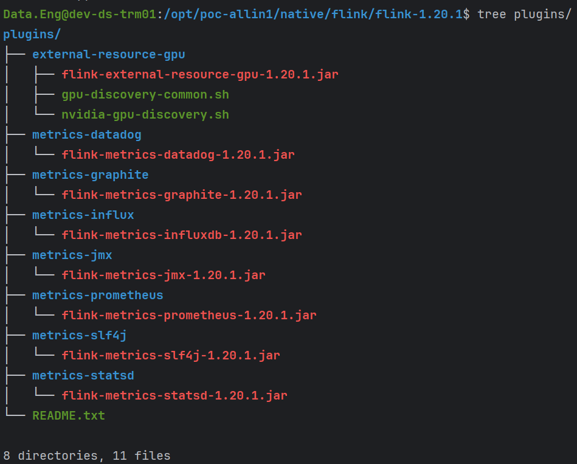

DataStream API - Hadoop Jar Package: only add plugins/s3-fs-hadoop/flink-s3-fs-hadoop

SQL Client - Hadoop Jar Package: mv plugins/s3-fs-hadoop/flink-s3-fs-hadoop and add flink-shaded-hadoop to lib/common

PS: flink-s3-fs-hadoop can only occur once, alternative one place in plugins/s3-fs-hadoop/ or in lib/common

