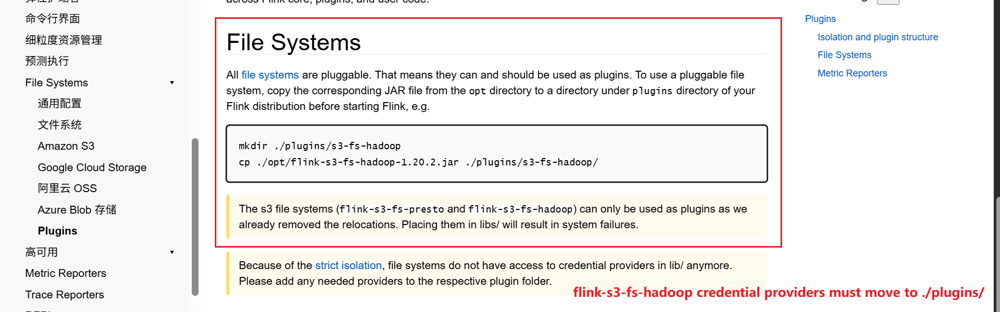

# S3 File System Credential Providers for Flink

## File Systems

All file systems are pluggable. That means they can and should be used as plugins. To use a pluggable file system, copy the corresponding JAR file from the opt directory to a directory under plugins directory of your Flink distribution before starting Flink, e.g.

```
mkdir ./plugins/s3-fs-hadoop
cp ./opt/flink-s3-fs-hadoop-1.20.2.jar ./plugins/s3-fs-hadoop/

# or
wget -P ./plugins/s3-fs-hadoop/ https://repo1.maven.org/maven2/org/apache/flink/flink-s3-fs-hadoop/1.20.1/flink-s3-fs-hadoop-1.20.1.jar
```

The s3 file systems (flink-s3-fs-presto and flink-s3-fs-hadoop) can only be used as plugins as we already removed the relocations. Placing them in libs/ will result in system failures.

Because of the strict isolation, file systems do not have access to credential providers in lib/ anymore. Please add any needed providers to the respective plugin folder.

```
flink-dist
├── conf
├── lib
...
└── plugins
    ├── s3
    │   ├── aws-credential-provider.jar
    │   └── flink-s3-fs-hadoop.jar
    └── azure
        └── flink-azure-fs-hadoop.jar
```

